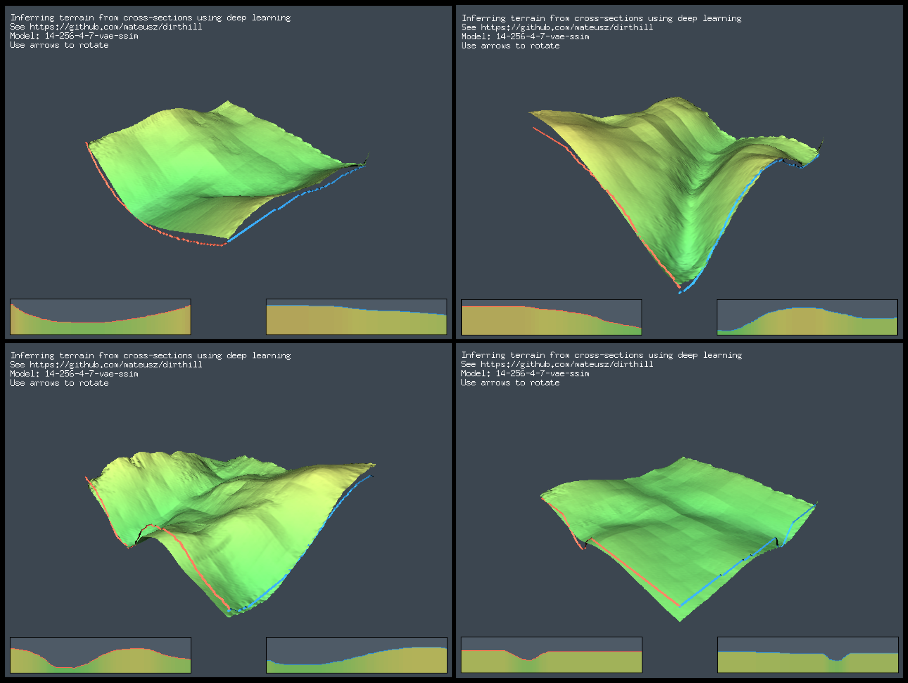

# Generating terrain from cross-sections

[-> INTERACTIVE DEMO <-](https://mateusz.github.io/dirthill/)

This terrain generator uses user-provided cross-sections for generating 3D terrain using convolutional neural networks. Implemented with PyTorch, user-side inference with [ONNX](https://onnxruntime.ai/), UI as a WASM module compiled from Golang, graphics with [Ebiten](https://github.com/hajimehoshi/ebiten) and [Tetra3D](https://github.com/SolarLune/tetra3d/).

